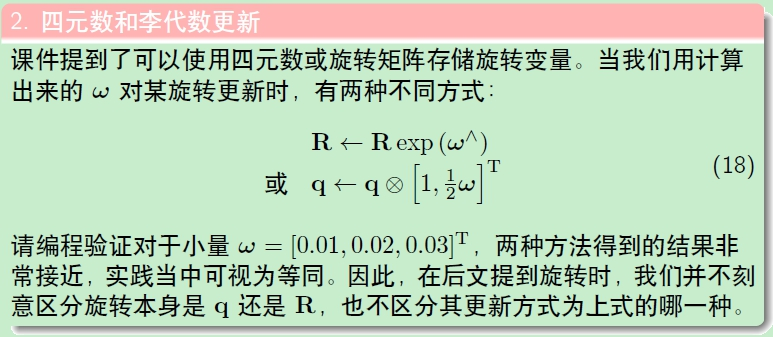

## 深蓝学院VIO课程第一期作业

环境为 **Ubuntu16.04**

		ros-kinetic
		opencv 3.3.1(无需安装，安装ros之后就有了)
		cmake 3.5.1
		eigen 3.3.3  usr/local/include/eigen3
		ceres 1.14.0
		Sophus
		Pangolin**
---
### 第1节

---
### 第2节

##### 2.1 设置IMU仿真代码中的不同参数，生成Allen方差标定曲线。

Allen方差工具：

[imu_utils](https://github.com/gaowenliang/imu_utils)

[kalibr_allen](https://github.com/kalibr_allen)

##### 2.2 将IMU仿真代码中的欧拉积分换成中值积分
---
### 第3节

---
### 第4节
补充作业代码中单目Bundle Adjustmnet信息矩阵的计算，并输出正确的结果。

正确结果为：奇异值最后7维接近于0，表明零空间的维度为7。

---
### 第5节
完成Bundle Adjustmnet求解器`Problem.cc`滑窗算法测试函数`Problem::TestMarginalize()`中的代码，并通过测试。

---
### 第6节

---
### 第7节
将第二节的仿真数据集（视觉特征、IMU数据）接入我们的VINS代码，并运行处轨迹结果。

##### 7.1 仿真数据无噪声

##### 7.2 仿真数据集有噪声（不同噪声设定时需要配置vins中imu noise大小）

---
### 第11节 大作业ch9
大作业为两个代码作业, 完成时间为三周:    

##### 11.1 更优的优化策略:   
a. 选用更优的 LM 策略, 使得 VINS-Mono 在 MH-05 数据集上收敛速度更快或者精度更高.  

b. 实现 dog-leg 算法替换 LM 算法, 并测试替换后的 VINS-Mono 在 MH_05 上算法精度.    

详细的实验报告包括:
- 对迭代时间和精度进行评估, 其中精度评估可以采用 [evo 工具]( https://github.com/MichaelGrupp/evo ) ；
- 对轨迹精度进行评估, 轨迹真值在 zip 中已给出。  

##### 11.2 更快的 makehessian 矩阵  
可以采用任何一种或多种加速方式 (如多线程, 如sse指令集等) 对信息矩阵的拼接函数加速, 并给出详细的实验对比报告.
